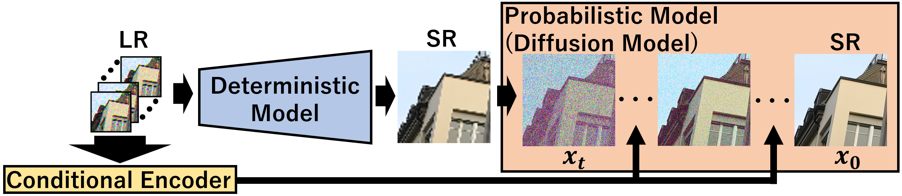

# BSRD (Burst Super-Resolution with Diffsuion Model)
This is the official repository for the following paper:

Kyotaro Tokoro, Kazutoshi Akita, and Norimichi Ukita

Burst Super-Resolution with Diffusion Models for Improving Perceptual Quality, IJCNN2024




## SyntheticBurst Dataset
### Training
- Download [Zurich RAW to RGB dataset](http://people.ee.ethz.ch/~ihnatova/pynet.html#dataset) and place it in './synth/zurich-raw-to-rgb'.
```
sh train_synth.sh
```
### Evaluation
- Download [syn_burst_val](https://data.vision.ee.ethz.ch/bhatg/syn_burst_val.zip) and place it in './synth/SyntheticBurstVal'.
- Download [BIPNet Trained model](https://mbzuaiac-my.sharepoint.com/:u:/g/personal/akshay_dudhane_mbzuai_ac_ae/EYlxq0X49fRGiFD3kMxnM6IB7VNtwhd3atNr4oc1b1psbA?e=pLN14I) or [BIPNet](https://github.com/akshaydudhane16/BIPNet/tree/main) and place it in './Trained_models/synth/BIPNet.ckpt'.
- Download [Burstormer Trained model](https://mbzuaiac-my.sharepoint.com/:u:/g/personal/akshay_dudhane_mbzuai_ac_ae/ER8mPnjoSIZAnaKA8YyCeE8BA_uQr_73b5qRZx9sh9Rzvw?e=Sc4HFJ) or [Burstormer](https://github.com/akshaydudhane16/Burstormer/tree/main) and place it in './Trained_models/synth/Burstormer.ckpt'.
- Download BSRD Trained model(coming soon) and place it in './Trained_models/synth/BSRD_synth.pt'.
        
```
sh sample_synth.sh
```


## BurstSR dataset
### Training
- Download [BurstSR train and validation set](https://github.com/goutamgmb/NTIRE21_BURSTSR/blob/master/burstsr_links.md).
```
sh train_real.sh
```
### Evaluation
- Download [burstsr_dataset](https://data.vision.ee.ethz.ch/bhatg/BurstSRChallenge/val.zip).
- Download [PWC Trained model](https://data.vision.ee.ethz.ch/bhatg/pwcnet-network-default.pth) and place it in './pwcnet/pwcnet-network-default.pth'.
- Download [BIPNet Trained model](https://mbzuaiac-my.sharepoint.com/:u:/g/personal/akshay_dudhane_mbzuai_ac_ae/EYlxq0X49fRGiFD3kMxnM6IB7VNtwhd3atNr4oc1b1psbA?e=pLN14I) or [BIPNet](https://github.com/akshaydudhane16/BIPNet/tree/main) and place it in './Trained_models/real/BIPNet.ckpt'.
- Download Burstormer Trained model(coming soon) or [Burstormer](https://github.com/akshaydudhane16/Burstormer/tree/main) and place it in './Trained_models/real/Burstormer.ckpt'.
- Download BSRD Trained model(coming soon) and place it in './Trained_models/real/BSRD_real.pt'.

```
sh sample_real.sh
```
